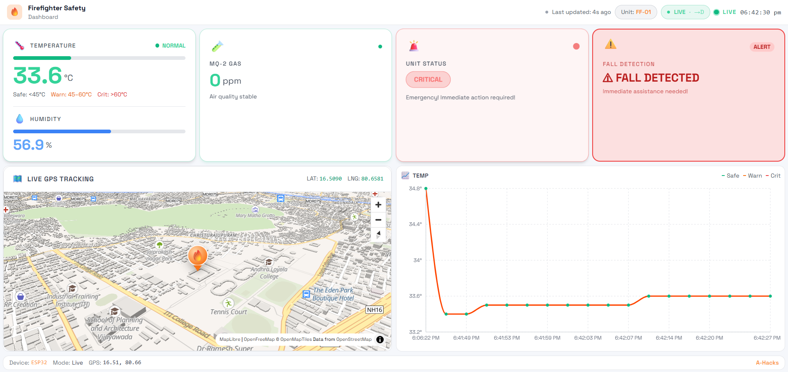

# ⚡ Power Pulse

> Built with ❤️ for A-Hacks 2026

[](https://authacks.com/) <!-- Replace with actual hackathon link if needed -->

## 🌟 Inspiration
*(What problem are you trying to solve? How did you come up with the idea?)*
Briefly describe the inspiration behind Power Pulse. 

## 💡 What it does
*(A brief overview of your project's functionality.)*
Power Pulse is a... Provide a concise summary of how it impacts users and what core features it provides.

## ⚙️ How we built it
*(Describe the technologies, frameworks, and architecture used for Power Pulse.)*
*   **Frontend:** [e.g., React, Next.js, Tailwind CSS]
*   **Backend:** [e.g., Node.js, Express, Python]
*   **Database:** [e.g., MongoDB, PostgreSQL, Firebase]
*   **Other:** [e.g., specific APIs, hardware components]

## 🚧 Challenges we ran into
*(What were the toughest technical challenges you faced during the 24 hours?)*
*   Integrating with the third-party API.
*   Managing state across the application.
*   Time constraints of the 24-hour hackathon format.

## 🏆 Accomplishments that we're proud of
*(What are you most proud of achieving during this hackathon?)*
*   Successfully building a working prototype within the time limit.
*   Learning a new framework or technology on the fly.
*   Creating an intuitive and beautiful user interface.

## 📚 What we learned
*(What new concepts, tools, or skills did you pick up?)*
*   How to effectively collaborate under pressure.
*   Implementing [Specific Feature/Tech].

## 🚀 What's next for Power Pulse
*(What features or improvements do you plan to add in the future?)*
*   Integrating user authentication.
*   Launching a mobile app version.
*   Expanding to support more data sources.

## 💻 Getting Started (Local Setup)

Follow these instructions to run Power Pulse on your local machine.

### Prerequisites
*   Node.js (v18 or higher recommended)
*   npm or yarn

### Installation
1. Clone the repository:
   ```bash
   git clone https://github.com/your-username/power-pulse.git
   cd power-pulse
   ```
2. Install dependencies:
   ```bash
   npm install
   # or yarn install
   ```
3. Run the development server:
   ```bash
   npm run dev
   # or yarn dev
   ```
4. Open your browser and navigate to the localhost port provided in your terminal (usually `http://localhost:3000` or `http://localhost:5173`).

## 🖼️ Dashboard Gallery

### Live Monitoring View


### Warning State View


### Emergency / Fall Alert View


## 👥 Team
**Team Name:** Fire Fighter Safety Device

### Hardware
*   **Sairam** - [GitHub](https://github.com/sairamgalam017) | [LinkedIn](https://www.linkedin.com/in/sairam-galam/)
*   **Santhosh** - [GitHub](https://github.com/chintu-boltey) | [LinkedIn](https://www.linkedin.com/in/santhosh-juvvanapudi-07a871373/)

### Software
*   **R.S.Manikanta** - [GitHub](https://github.com/Rsmk27) | [LinkedIn](https://www.linkedin.com/in/srinivasamanikanta/)
*   **Ramu** - [GitHub](https://github.com/ramunarlapati-13) | [LinkedIn](https://www.linkedin.com/in/ramunarlapati/)

---
*Created for the A-Hacks 2026 Hackathon.*
